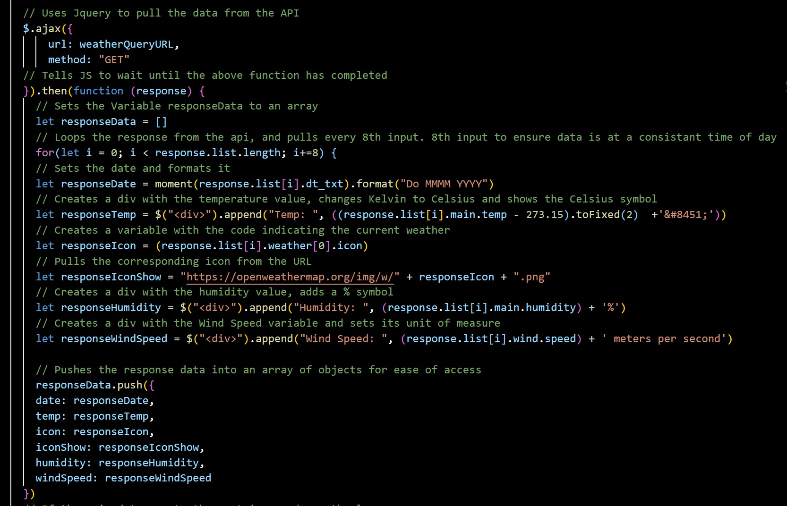

# Weather-Dashboard

I was employed to create a website which can show the 5 day weather forecast for any city in the world. To enable travelers to plan their trips.

## The Goal

The objective was to present a 5 day weather forecast of a user defined City.

The important aspects were:

    - Using OpenWeather API to retrieve the location and weather.
    - Show multiple weather attributes:
        - The city name
        - The date
        - The temperature
        - The icon showing the current weather
        - The humidity
        - The wind speed
    - Once a search has been completed, save it in a history tab.

## Usage

To view the project, please follow the below links:

https://bcott93.github.io/Weather-Dashboard/

## License

Please see the License in the Repo.
